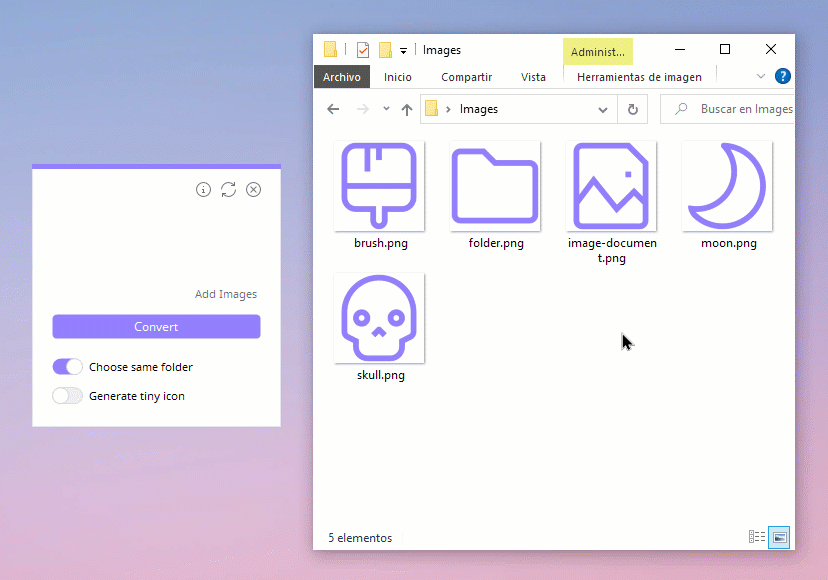
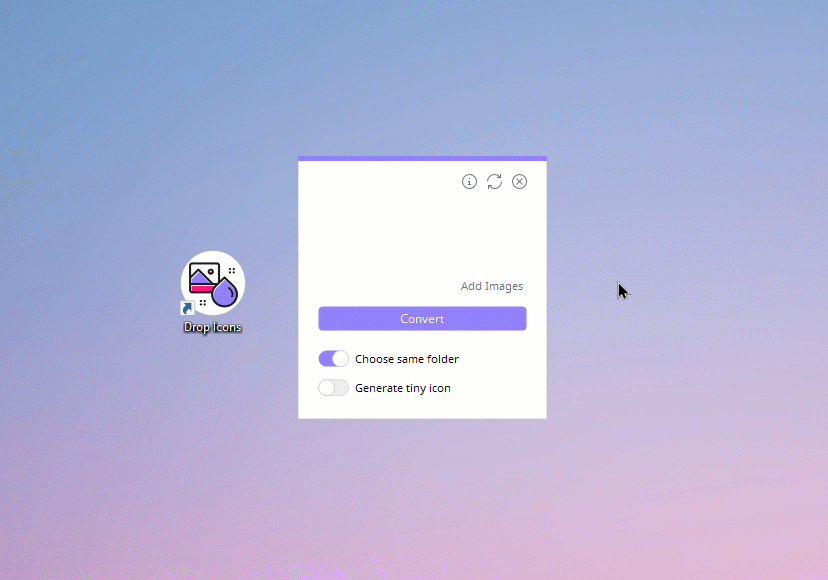

<h1 align="center">Drop Icons</h1>

Drop Icons es una aplicación para convertir imágenes a iconos (.ico) para Windows, con una función simple de arrastrar y soltar.

 
 
  
 
 

<a href="README.md">English</a> :speech_balloon: <a href="README-es.md">Español</a>

## Características
* Interfaz limpia e intuitiva.
* Convierte rápidamente muchas imágenes en iconos a la vez, con la función de arrastrar y soltar.
* Cambiar entre el idioma English y Español.
* Personalizar el color del tema.
* Número de las imágenes a convertir, restando tres que se muestran como vista previa.
* Guardar los iconos en la misma carpeta (por defecto).
* Guardar los iconos en una carpeta específica.
* Guarda la configuración en un archivo .ini (excepto para los switches).
* Habilitar y deshabilitar TopMost.
* Los iconos generados son de 16 píxeles pero incluyen tamaños de 16, 32, 48, 64, 128, 256 píxeles para un ícono de alta calidad.
* Evita la duplicación de una imagen que se ha añadido previamente.
* Opción para generar un icono mini.
* Cambia el tamaño a 1:1 sin estirar la imagen.

## Previa

## Uso
Arrastra y suelta tus imágenes en el espacio vacío, obtendrás una vista previa de tres imágenes, excepto si solo arrastras una o dos. Más abajo puedes ver la cantidad total de imágenes para convertir (restando tres de la previa). Si no puedes arrastrar, cliquea en `Agregar`.

Deja el primer switch activado si deseas guardarlos en la misma carpeta, si prefieres elegir una carpeta específica, desactivalo. También puedes generar un icono mini activando el segundo switch. Por último, haz clic en el botón `Convertir`, aparecerá un círculo de carga y una vez que todo esté limpio en la interfaz, tendrás tus iconos creados.

Si necesitas eliminar las imágenes que agregaste por error, haz clic en el icono de las flechas. Recuerda que puedes arrastrar imágenes tantas veces como quieras incluso antes de hacer clic en el botón `Convertir`.

 

Dando click en el botón superior de Info, aparecerá una nueva ventana en la que puedes:

- **Cambiar el idioma:** En la sección inferior que dice **Idioma de Drop Icons** haz clic en el icono de las flechitas para cambiar entre Español o English, luego clic en el botón de regresar y se reiniciará con el idioma que hayas elegido.

- **Cambiar el tema:** En la parte inferior, clic sobre `Change Theme...` y elige tu color personalizado en la pequeña ventana que aparece, también puedes agregarlo a tus "colores personalizados" para usarlo después, luego selecciona Aceptar. Para regresar al que venía por defecto repite los pasos anteriores, elige uno de los tantos morados (o no elijas ningún color) y cliquea en Aceptar.

- **Encontrar información sobre el contenido de terceros:** En la sección superior están los nombres de cada librería, proyecto, iconos o tipografías que fueron utilizados, al igual que Drop Icons. Cliquea en uno de ellos para leer su licencia, la cual incluye el autor(a) o autores(as). Puedes leer una corta descripción más abajo o hacer clic sobre el icono del enlace para ir al repositorio o sitio oficial.

 

Para elegir que Drop Icons esté encima de todas las ventanas (TopMost) o no, da clic derecho en cualquier lugar de la ventana principal y elige Habilitar TopMost o Deshabilitar TopMost.

## Opciones

## Instalador
Para compilar el instalador es necesario [Inno Setup](https://jrsoftware.org/isinfo.php), los archivos se encuentran en la carpeta [installer src](/installer%20src). Solo debes abrir el proyecto (Installer.iss) y compilarlo, a menos que desees hacer una modificación. Al finalizar, en la misma ubicación dejará una carpeta llamada Output.

**Portable with 7zip.bat** permite comprimir en .zip rápidamente la versión portable y elimina archivos innecesarios. Únicamente funciona con [7zip](https://www.7-zip.org/).

Ambos .iss y .bat obtienen los archivos que son necesarios dentro de su carpeta y/o la carpeta Release (debido a las rutas relativas).

## Contribuciones
* Si haces comentarios en el código, preferiblemente en Español, por favor.
* Los nombres de las variables deben estar en Inglés.
* Si abres un **Issue**, puede ser en Inglés o Español.
* **Pull request** en Inglés, en la descripción puedes agregar detalles en Inglés o Español.

## Configuración
El archivo `Config.ini` almacena información del lenguaje, color del tema y si está activada o no la opción TopMost.

~~~
[Options]
Language = en
TopMost = true

[Theme]
146
128
255
~~~

>Nota: las dos opciones de tipo switch no se guardan porque no son opciones que suelan activarse todo el tiempo.

En el archivo `Colors.dat` se guarda la paleta de colores personalizados.

Drop Icons primero busca ambos archivos en la misma carpeta donde se ubica el ejecutable, así que, si tuvieras la versión portable e instalable, no habría problemas.

Si no encuentra los archivos, eso significa decir que está instalado y buscará en *%AppData%\Drop Icons*

## Controles
Si necesitas agregar más o diferentes controles, haz clic derecho en cualquier parte del Cuadro de herramientas, cliquea en Agregar pestaña y escribe *AltoControls*.

Da clic derecho en cualquier lugar dentro de la pestaña que creaste, cliquea en `Elegir elementos...` y selecciona **Componentes de .NET Framework**. Ahora desde `Examinar...` agrega **AltoControls.dll** que se ubica en la carpeta Lib y por último Aceptar.

## Creditos
Drop Icons está basado en [Iconizer](https://github.com/willnode/Iconizer) bajo [MIT License](https://github.com/willnode/Iconizer/blob/master/LICENSE), y como un reconocimiento, mantiene un archivo con ese nombre.

Incluye una version compilada de [AltoControls](https://github.com/aalitor/AltoControls) bajo [MIT License](https://github.com/aalitor/AltoControls/blob/on-development/license.txt), con dos archivos modificados:
* **SlideButton**: Borde y colores para darle un estilo aún más moderno.
* **AltoButton**: Reemplazo de DrawString con una Label, para que detecte la fuente utilizada sin estar instalada.

*Puedes encontrar los archivos modificados [aquí](https://github.com/genesistoxical/modified-files/tree/main/AltoControls).*
~~~
SwitchButton.cs
AltoButton.cs
~~~

[FolderBrowserEx](https://github.com/evaristocuesta/FolderBrowserEx) library bajo [MIT License](https://github.com/evaristocuesta/FolderBrowserEx/blob/master/LICENSE).

Contiene toda la familia de [Noto Sans](https://fonts.google.com/noto/specimen/Noto+Sans) bajo [SIL Open Font License](#), aunque solo utiliza la versión Regular.

Los iconos son parte de [Teenyicons](https://github.com/teenyicons/teenyicons) bajo [MIT License](https://github.com/teenyicons/teenyicons/blob/master/LICENSE).

*Puedes encontrar todas las licencias [aquí](/src/DropIcons/Docs).*

## Licencia
**MIT License**

Copyright (c) 2022 Génesis Toxical ([read here](LICENSE)).
