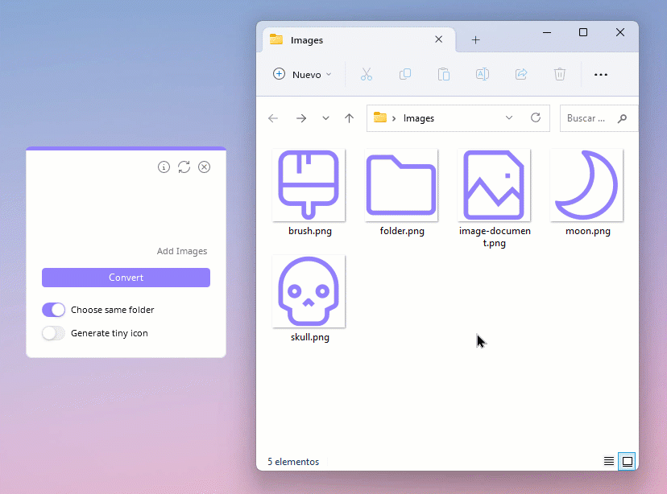
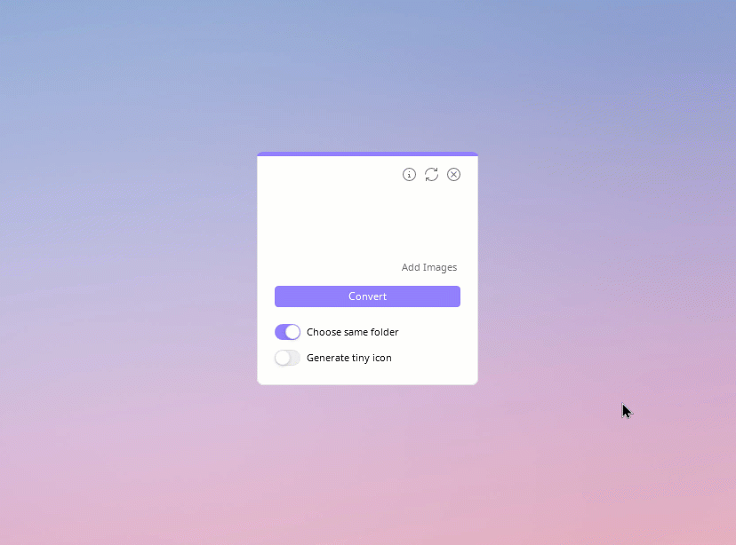
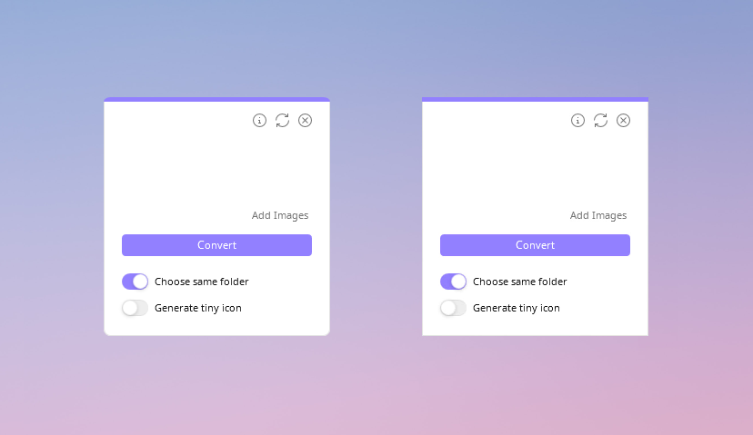

<h1 align="center">Drop Icons</h1>

Drop Icons is an app to convert images to icons (.ico) for Windows, with a simple Drag and Drop feature.

 
 
  
 
 

<a href="README.md">English</a> :speech_balloon: <a href="README-es.md">Español</a>

## Features
* Clean and intuitive interface.
* Quickly convert multiple images to icons at once, with Drag and Drop feature.
* Switch between English and Spanish language.
* Support for .png .jpg .jpeg .jfif .bmp .gif and .svg images.
* Customize theme color.
* Number of images to convert, subtracting three that are displayed as preview.
* Settings are saved in an .ini file, except for switches.
* Save icons in the same folder (default) or in a specific one.
* Enable and disable Topmost.
* Format options to choose sizes included within the icon, multiple and 256 px. [𝐢](#details)
* Prevent duplication of an image that has been previously added.
* Option to generate tiny icon.
* Adaptive corners (rounded or metro), depending on the OS version.

## Preview

## Usage
Drag and drop your images into the empty space, you will preview three images except if you only drag one or two. Below you can see the total amount of images to convert, subtracting three from preview. If you cannot drag, click on `Add images`.

Leave the first switch on if you want to save them in the same folder, if you prefer to choose a specific folder, turn it off. You can also generate a tiny icon by turning on the second switch. Finally, click on `Convert` button, wait for the interface to restart because this indicates that it has finished and your icons are ready.

If you need to delete the images you have added by mistake, click on the arrows icon. Remember that you can drag images as many times as you want before clicking the `Convert` button.

 
By clicking on the upper Info button, a new window will appear in which you can:

- **Change theme:** Click on `Change Theme` to open the color picker and choose a custom one, then click Apply. To return to default values, repeat the previous steps and press the purple button below the tone selector. Finally click Apply.

- **Change language:** In the **Language** section below, click on the little arrows icon to change between English or Español, finally click on the return button to apply and see changes.

- **Format:** Clicking on `Format` will display a menu with two options to choose the sizes that will be included within the icon: **Multiple** generates a high quality icon that include all necessary sizes such as 16, 32, 48, 64, 128 and 256 pixels, although the output dimensions will be 16px. The last option is **256 px** which generates an icon with a single size but look pixelated in the details view.
     >Note: If the **Generate tiny icon** switch is on, a small icon will be created regardless of its format.
     
- **Third-party content:** On the left side are the names of each library, project, icons or fonts that were used, click one to read its license and author(s), as well as a short description. You can click on the clip icon to go to each repository/official site and change pages with **Next 🢖🢖** or **🢔🢔 Back**.

 

To choose whether Drop Icons is on top of all windows (Topmost) or not, right-click anywhere in the main window and choose Enable Topmost or Disable Topmost.

## Options

## Installer
To compile the installer you need [Inno Setup](https://jrsoftware.org/isinfo.php), the files are located in the [installer src](/installer%20src) folder. You just need to open the project (Installer.iss) and compile it, unless you want to make a change. When finished, it will leave a folder called Output in the same location.

>* Please note that you must first compile the source code in Visual Studio to get the binaries, otherwise you will get a [📍Compiler Error](https://github.com/genesistoxical/drop-icons/issues/3).
>* Alternatively, you can download the compiled app from the Drop Icons [page](https://genesistoxical.github.io/drop-icons/).

**Portable with 7zip.bat** allows you to quickly zip the portable version. It only works with [7zip](https://www.7-zip.org/).

Both .iss and .bat get the files that are needed within their folder and/or the Release folder (due to relative paths).

## Contributing
* **HandyControls** package will no longer be updated (for now or permanently) as the latest version does not allow resizing of ToggleButtonSwitch.
* If you make comments in the code, preferably in Spanish, please.
* Variable names must be in English.
* If you open an **Issue**, it can be in English o Spanish.
* **Pull request** in English, in the description you can add details in English or Spanish.
* When converting **.svg** it is first converted to **.png** in a temporary folder and then from **.png** to icon. The priority would be **.svg** "directly" to icon.
  
## Config
`Config.ini` file stores information about the language, theme color, icon format and whether or not the Topmost option is enabled.

~~~
[Options]
Language = en
Topmost = false

[Theme]
#FF9280FF

[Format]
Size = multiple
~~~

>Note: The two switch-type options are not saved because they are not options that are usually activated all the time.

## Adaptive corners

## Credits
Drop Icons is based on [Iconizer](https://github.com/willnode/Iconizer) under [MIT License](https://github.com/willnode/Iconizer/blob/master/LICENSE).

* [HandyControls](https://github.com/ghost1372/HandyControls) under [MIT License](https://github.com/ghost1372/HandyControls/blob/develop/LICENSE).

* [FolderBrowserEx](https://github.com/evaristocuesta/FolderBrowserEx) library under [MIT License](https://github.com/evaristocuesta/FolderBrowserEx/blob/master/LICENSE).

* [Noto Music](https://fonts.google.com/noto/specimen/Noto+Music) under [SIL Open Font License](/src/DropIcons/Docs/Noto%20Music/OFL.txt).

* Icons are part of [Teenyicons](https://github.com/teenyicons/teenyicons) under [MIT License](https://github.com/teenyicons/teenyicons/blob/master/LICENSE).

* [SharpVectors](https://github.com/ElinamLLC/SharpVectors/) under [BSD 3-Clause](https://github.com/ElinamLLC/SharpVectors/blob/master/License.md).

* [WinVersion](https://github.com/shaovoon/win_version_detection) detection under [MIT License](https://github.com/shaovoon/win_version_detection/blob/main/LICENSE).

*You can find all licenses [here](/src/DropIcons/Docs).*

## What's new?
`Version 1.0.0` was built on Windows Forms. Drop Icons will no longer be developed using that technology, however you can still find and/or download the latest official version here:
 
🏷️ [winforms-v1-final](https://github.com/genesistoxical/drop-icons/tree/winforms-v1-final)

 

`Version 2.0.0` is developed with Windows Presentation Foundation (WPF) to improve the interface and include adaptive rounded corners, depending on the OS version.

In this second release the **About** window has been improved, the **Config.ini** file has been modified to use only theme color HEX and not RGB, also the color picker (for theme) has been replaced for a much more modern one.

Due to this last change, **Colors.dat** was removed since there is no button to save the custom ones, instead there is a color palette.

 

`Version 2.1.1` allows you to convert three more formats; **.jfif .gif** and **.svg**, for the latter it was necessary to add compatibility [📍Can you add support to SVG file?](https://github.com/genesistoxical/drop-icons/issues/2). There are now size options for icons: **Multiple** and **256 px** [📍Icon Default 256x256](https://github.com/genesistoxical/drop-icons/discussions/1).

In addition to other small improvements, a new page was implemented in the **About** window and a folder named **Libs** was added in the binaries for better organization of dll(s).

 

`Version 2.1.2` includes minor updates to the **About** window: the option to choose the sizes that will be included within the icon has been renamed to **Format** instead of **Icons**. This to avoid confusion.

Updated an issue with an attribution link and removed an unused control. As well as other small changes in code variables.

## License
**MIT License**

Copyright (c) 2022 - 2023 Génesis Toxical ([read here](LICENSE)).

 

## Related:
`🩷 Image to Icon` Convert image to icon online: [`imagetoicon.glitch.me`](https://imagetoicon.glitch.me/) or [`Repository`](https://github.com/genesistoxical/imagetoicon).

`🩷 Pixie Folders` Set of six minimalist and editable folder icon designs: [`Download`](https://genesistoxical.github.io/pixie-folders/) or [`Repository`](https://github.com/genesistoxical/pixie-folders).