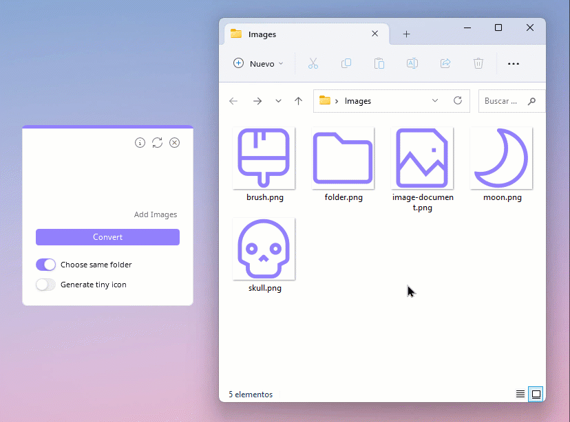

Drop Icons is a open source utility to convert images to icons (.ico) for Windows, with a simple Drag and Drop feature.

## Features
* Clean and intuitive interface.
* Quickly convert multiple images to icons at once, with Drag and Drop feature.
* Switch between English and Spanish language.
* Support for .png .jpg .jpeg .jfif .bmp .gif and .svg formats.
* Customize theme color.
* Number of images to convert, subtracting three that are shown as preview.
* Save icons in the same folder (default).
* Save icons in a specific folder.
* Saves the configuration to an .ini file (except for switches).
* Enable and disable Topmost.
* Choose between high quality icons with multiple sizes or just 256 px as a single size.
* Prevent duplication of an image that has been previously added.
* Option to generate tiny icon.
* Adaptive corners (rounded or simple), depending on the OS version.
  
## Preview
<picture></picture>

## Usage
Drag and drop your images into the empty space, you will preview three images except if you only drag one or two. Below you can see the total amount of images to convert (subtracting three from preview). If you cannot drag, click on `Add images`.

Leave the first switch on if you want to save them in the same folder, if you prefer to choose a specific folder, turn it off. You can also generate a tiny icon by turning on the second switch. Finally, click on `Convert` button, wait for the interface to restart because this indicates that it has finished and your icons are ready.

If you need to delete the images you have added by mistake, click on the arrows icon. Remember that you can drag images as many times as you want even before clicking the `Convert` button.

 

By clicking on the upper Info button, a new window will appear in which you can:

- **Change language:** In the **Language** section below, click on the little arrows icon to change between English or Español, finally click on the return button to apply and see changes.

- **Change theme:** Click on `Change Theme` to open the color picker and choose a custom one, then click Apply. To return to the default, repeat the previous steps and press the purple button below the tone selector, finally click Apply.

- **Icons (size):** By clicking on `Icons` a menu will be displayed with two options (check the box); **Multiple** generates icons that include all necessary sizes such as 16, 32, 48, 64, 128 and 256 px. On the other hand, **256 px** generates icons of a single size but these look pixelated when displayed small.

- **Third-party content:** On the left side are the names of each library, project, icons or fonts that were used, click one to read its license and author(s), as well as a short description. You can click on the clip icon to go to each repository/official site and change pages with **Next 🢖🢖** or **🢔🢔 Back**.

 

To choose whether Drop Icons is on top of all windows (Topmost) or not, right-click anywhere in the main window and choose Enable Topmost or Disable Topmost.

## Options
<picture></picture>

## Info
* Drop Icons is based on [Iconizer](https://github.com/willnode/Iconizer){:target="_blank"}. Read more credits [here](https://github.com/genesistoxical/drop-icons#credits){:target="_blank"}.
* This software is under **MIT License** ([read full text](https://github.com/genesistoxical/drop-icons/blob/master/LICENSE){:target="_blank"}).
* Copyright (c) 2022 - 2023 Génesis Toxical.
 

